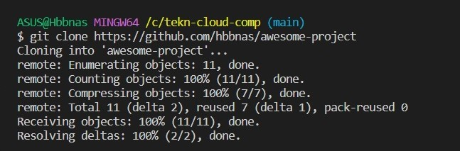

# Latihan Minggu - 01

1. Install Git: ``DONE``
    - 

2. Konfigurasi Git: ``DONE``
    - 

3. Kelola Repo: ``DONE``
    - Membuat Repo Baru
    - 
    
    - Clone Repo
    - 

    - Menambahkan File
    - 

    - Menambahkan Branch
    - 

    - Mengubah/Menambahkan Isi dengan Branching and Merging
    - 
    - 
    - 

    - Undo Commit Terakhir
    - 
