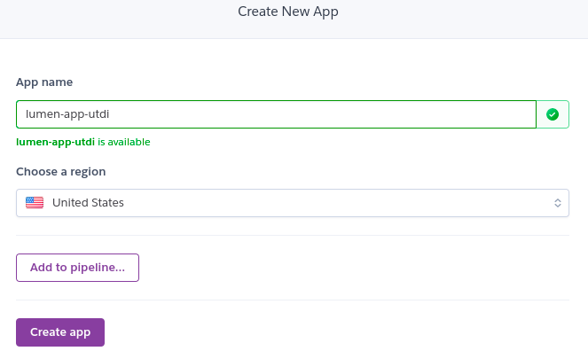
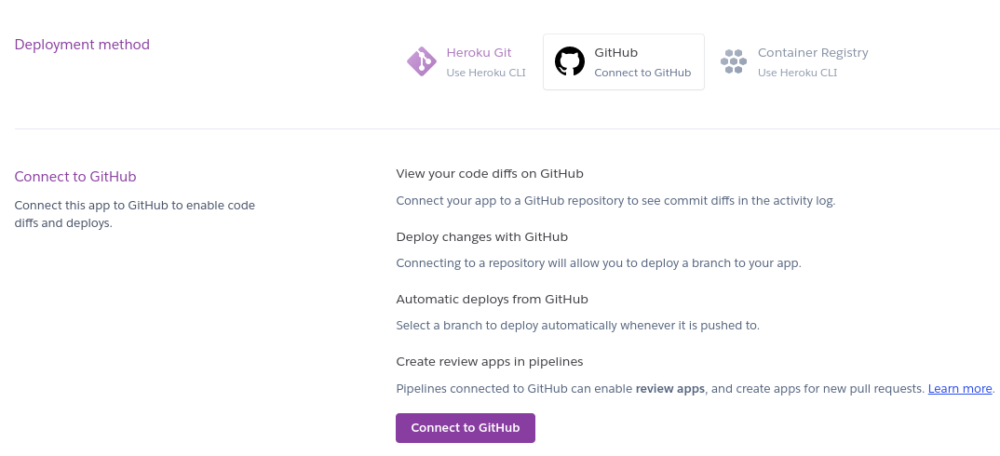
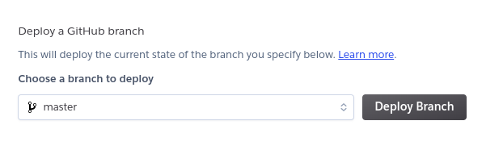
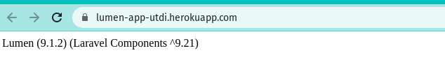

## Deployement on Heroku with PHP

### Download sekeleton lumen framework PHP
``composer create-project --prefer-dist laravel/lumen lumen-app``

### Upload to Github

### Create new environment in Heroku

### Connecting Github with Heroku

### Connect to Repo
Mohon Maaf Pak Terkendala dalam Connet to Repo Karena Berbayar 

### Deploying

### link website
[lumen-app](https://lumen-app-utdi.herokuapp.com/)

